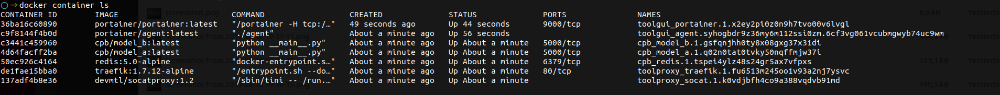
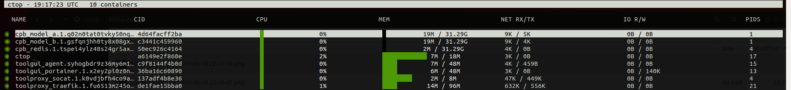
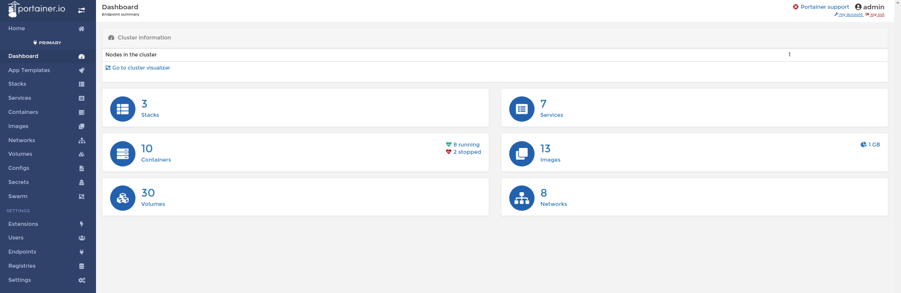
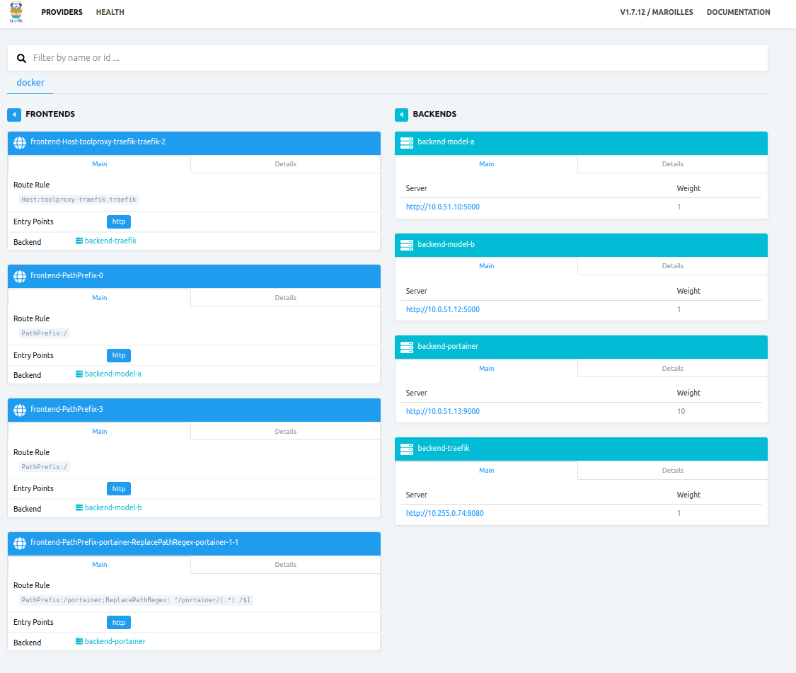

# 🤖 🐋 📚 ML Docker Stack 📚 🐋 🤖
Toy project that have an aim to show how to struct ML project to run in production.

# 🏃‍ How to run 🏃‍♀️

- Install images
    ```
    docker build -t service_one/model_a services/service_one/model_a/ --no-cache
    docker build -t service_one/model_b services/service_one/model_b/ --no-cache
    ```

- Init swarm cluster on your local machine
    ```
    docker swarm init
    ```
    If you get an error saying that you have multuple networks, you should select 
    one of the presented ip's and run
    ```
    docker swarm init --advertise-addr YOUR_ADDRESS
    ```

- Run stack
    ```
    chmod u+x runup.sh && ./runup.sh
    ```



- You can check balancing with oneliner
    ```
    while true; do sleep 0.01; curl http://0.0.0.0; echo -e '\n\n\n\n'$(date);done
    ```

- Monitor results
    ```
    chmod u+x runctop.sh &&  ./runctop.sh
    ```
    
- Stop stack (if you want)
    ```
    chmod u+x runup.sh && ./rundown.sh
    ```

# 🌲 Structure 🌲
```
.
|____Pipfile
|____Pipfile.lock
|____service_one.yml
|____config_and_vars.sh
|____services
| |____hydra
| |____common
| |____service_one
| | |____model_b
| | | |____utils.py
| | | |______init__.py
| | | |____Dockerfile
| | | |____requirements.txt
| | | |____templates
| | | | |____index.html
| | | |______main__.py
| | |____model_a
| | | |____utils.py
| | | |______init__.py
| | | |____Dockerfile
| | | |____requirements.txt
| | | |____templates
| | | | |____index.html
| | | |______main__.py
|____README.md
|____toolgui.yml
|____rundown.sh
|____runup.sh
|____toolproxy.yml
|____configs
| |____traefik.toml
|____runctop.sh
|____doc
| |____static
| | |____stack__portainer.png
| | |____stack__traefik.png
| | |____stack__container_ls.png
| | |____stack__runctop.png
|____.idea
| |____modules.xml
| |____ml_docker_stack.iml
| |____misc.xml
| |____workspace.xml
|____shellcheck.sh
```

# 🔐 Traefik password 🔐
```
user: admin / pass: changethispass
```

# 📜 Scripts 📜
- **runctop.sh** - monitoring all containers

- **runup.sh** - run stack
- **rundown** - stop stack

###### Additional scripts (runs before every script)
- **shellcheck.sh** - additional script for useful bash functions (empty)
- **config_and_vars.sh** - additional script for configurations


# 🍸 Services 🍸
### service_one
Generate random pokemon names
- **redis**
    - save information about
- **model_a**
- **model_b**

## toolgui
Web-tools that provide us monitoring information.
- **portainer** http://0.0.0.0/portainer
    - monitoring cluster health

## toolproxy
Main service that provide us reverse-proxy functional
- **socat**
    - to create a bidirectional byte stream between a TCP socket and the Docker Unix socket.
- **traefik** http://0.0.0.0:8080/dashboard/
    - reverse proxy that acts as router



# ❤ Reference repos ❤
- https://github.com/pascalandy/docker-stack-this/tree/master/traefik_stack5
- https://github.com/uSasha/pydata_demo
